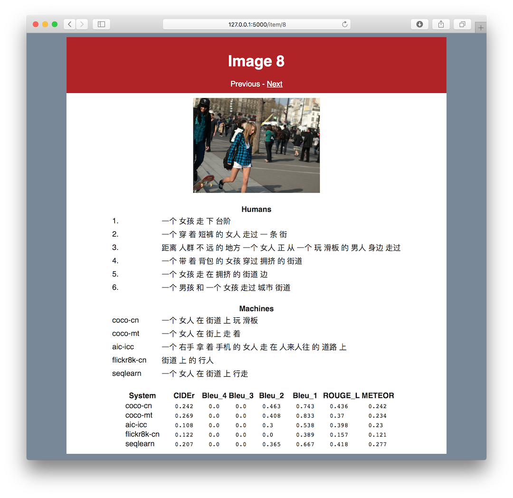

# COCO-CN output inspector
This is a lightweight tool to inspect the results of different image description
systems on the COCO-CN test set. It automatically downloads the images as you
browse through the results. This saves you from having to download *all* the
images in the dataset. I've also provided a script to download the images, if you
need to work offline.

## Requirements

* Python 3.6
* Flask 0.12

Other versions may work, but remain untested. I recommend [downloading Anaconda](https://www.anaconda.com/download/).

## Screenshot
Here's a preview of the tool. There's a simple navigation menu (previous, next),
with the image below, followed by the human-generated descriptions, the descriptions
generated by the systems, and the evaluation metrics.



## How to run this tool

To run the tool, just use `python resultsviewer.py` on the command line.
If you want to download the images first, run `python download_images.py` and wait for the script to complete. This may take a long time.

## Contact
* Tool: Emiel van Miltenburg, Tilburg University
* Data: Xirong Li, Renmin University of China

## Reference
If you find this repository useful, please
* Link back to it in your work.
* Cite the original paper by Li et al. See:

```
@article{DBLP:journals/corr/abs-1805-08661,
  author    = {Xirong Li and
               Xiaoxu Wang and
               Chaoxi Xu and
               Weiyu Lan and
               Qijie Wei and
               Gang Yang and
               Jieping Xu},
  title     = {{COCO-CN} for Cross-Lingual Image Tagging, Captioning and Retrieval},
  journal   = {CoRR},
  volume    = {abs/1805.08661},
  year      = {2018},
  url       = {http://arxiv.org/abs/1805.08661},
  archivePrefix = {arXiv},
  eprint    = {1805.08661},
  timestamp = {Mon, 13 Aug 2018 16:48:10 +0200},
  biburl    = {https://dblp.org/rec/bib/journals/corr/abs-1805-08661},
  bibsource = {dblp computer science bibliography, https://dblp.org}
}
```
